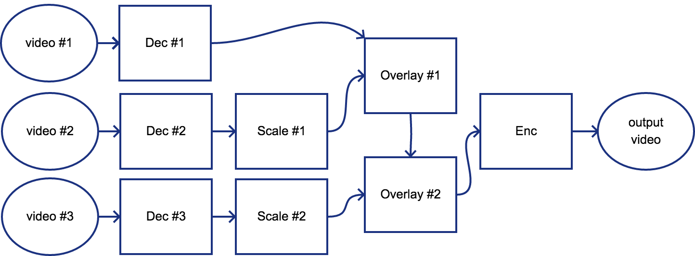

# 영상처리 성능 테스트
## 목적
- Jetson TX1, TX2를 가지고 디코딩/인코딩/비디오 스케일링/비디오 오버레이 성능 파악
## 시나리오
- 3개의 1080p30f 파일을 디코딩 후 스케일링과 오버레이 작업을 거친 후 1개의 1080p30f 로 H.264 인코딩 후 FLV 컨테이너로 먹싱 후 rtmp로 송신


## 테스트 방법
- GStreamer v1.0 Command Line Tool을 사용하여 진행
- 비디오 디코더는 H.264 omxh264dec(H/W) 사용
- 비디오 인코더는 H.264 omxh264enc(H/W) 사용
- 비디오 스케일링은 nvvidconv(H/W) 사용
- 비디오 오버레이는 glvideomixer(GPU) 사용
## 테스트 환경
- Jetson TX1
- Jetson TX2
- 영상파일
    - H.264 Profile High, 1080p30f, Bitrate: 3200k 사용, 음성 AAC 192Kbps 기준
## 측정 방법
- tegrastats 유틸리티 사용
## 테스트 내역
- GStreamer v1.0 지원 플러그인 확인
    - H.264 디코더/인코더 지원 여부 확인
    ```sh
    $ gst-inspect-1.0 | grep omxh264
    omx:  omxh264enc: OpenMAX H.264 Video Encoder
    omx:  omxh264dec: OpenMAX H.264 Video Decoder
    ```
    - H/W 비디오 스케일링 지원 여부 확인
    ```sh
    $ gst-inspect-1.0 | grep nvvidconv
    nvvidconv:  nvvidconv: NvVidConv Plugin
    ```
    - GPU 비디오 오버레이
    ```sh
    gst-inspect-1.0 | grep glvideomixer
    opengl:  glvideomixer: OpenGL video_mixer bin    
    ```
- 시나리오 테스트
    ```sh
$ gst-launch-1.0 -e glvideomixer name=mix sink_0::xpos=0 sink_0::ypos=0 sink_1::xpos=0 sink_1::ypos=240 sink_2::xpos=1280 sink_2::ypos=240 ! omxh264enc ! h264parse ! flvmux streamable=true name=mux ! rtmpsink location="rtmp://a.rtmp.youtube.com/live2/[Key] live=true" filesrc location="video1.mp4" ! qtdemux name=demux_0 demux_0.video_0 ! queue ! h264parse ! omxh264dec ! nvvidconv ! 'video/x-raw' ! tee ! queue ! mix.sink_0 filesrc location="video2.mp4" ! qtdemux name=demux_1 demux_1.video_0 ! queue ! h264parse ! omxh264dec ! nvvidconv ! 'video/x-raw, width=1280, height=720' ! tee ! queue ! mix.sink_1 filesrc location="video3.mp4" ! qtdemux name=demux_2 demux_2.video_0 ! queue ! h264parse ! omxh264dec ! nvvidconv ! 'video/x-raw, width=640, height=360' ! tee ! queue ! mix.sink_2 audiomixer name=amix ! audioconvert ! voaacenc ! mux.audio demux_1.audio_0 ! queue ! avdec_aac ! audioconvert ! amix.sink_0 demux_2.audio_0 ! queue ! avdec_aac ! audioconvert ! amix.sink_1 demux_0.audio_0 ! queue ! avdec_aac ! audioconvert ! amix.sink_2
    ```
## 테스트 결과
```sh
RAM 1983/3983MB (lfb 80x4MB) cpu [39%,40%,41%,20%]@1734 EMC 30%@1600 APE 25 NVDEC 716 MSENC 716 GR3D 80%@153
RAM 1982/3983MB (lfb 80x4MB) cpu [24%,19%,68%,27%]@1428 EMC 31%@1600 APE 25 NVDEC 716 MSENC 716 GR3D 53%@153
RAM 1982/3983MB (lfb 80x4MB) cpu [25%,31%,73%,23%]@1734 EMC 30%@1600 APE 25 NVDEC 716 MSENC 716 GR3D 58%@153
RAM 1982/3983MB (lfb 80x4MB) cpu [21%,35%,75%,21%]@1734 EMC 30%@1600 APE 25 NVDEC 716 MSENC 716 GR3D 72%@153
RAM 1982/3983MB (lfb 80x4MB) cpu [37%,40%,44%,19%]@1734 EMC 30%@1600 APE 25 NVDEC 716 MSENC 716 GR3D 39%@153
RAM 1982/3983MB (lfb 80x4MB) cpu [38%,32%,60%,29%]@1734 EMC 30%@1600 APE 25 NVDEC 716 MSENC 716 GR3D 72%@153
RAM 1982/3983MB (lfb 80x4MB) cpu [25%,56%,51%,24%]@1734 EMC 30%@1600 APE 25 NVDEC 716 MSENC 716 GR3D 63%@153
RAM 1982/3983MB (lfb 80x4MB) cpu [35%,52%,56%,19%]@1734 EMC 30%@1600 APE 25 NVDEC 716 MSENC 716 GR3D 38%@153
RAM 1982/3983MB (lfb 80x4MB) cpu [36%,14%,86%,28%]@1734 EMC 30%@1600 APE 25 NVDEC 716 MSENC 716 GR3D 47%@153
RAM 1982/3983MB (lfb 80x4MB) cpu [40%,62%,38%,22%]@1734 EMC 30%@1600 APE 25 NVDEC 716 MSENC 716 GR3D 26%@460
RAM 1982/3983MB (lfb 80x4MB) cpu [30%,79%,34%,26%]@1734 EMC 31%@1600 APE 25 NVDEC 716 MSENC 716 GR3D 0%@537
RAM 1982/3983MB (lfb 80x4MB) cpu [17%,25%,29%,68%]@1734 EMC 31%@1600 APE 25 NVDEC 716 MSENC 716 GR3D 2%@153
RAM 1981/3983MB (lfb 80x4MB) cpu [35%,25%,25%,61%]@1734 EMC 31%@1600 APE 25 NVDEC 716 MSENC 716 GR3D 57%@153
```
## 결론
- 해당 사니리오 정도의 영상처리는 가능
## 기타
- H/W 디코더 4개와 H/W 인코더 1개 동시에 사용 가능
